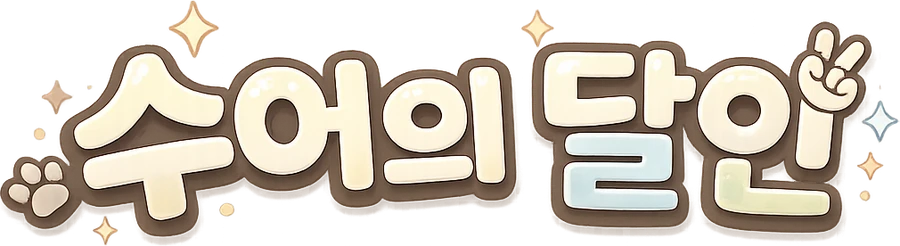
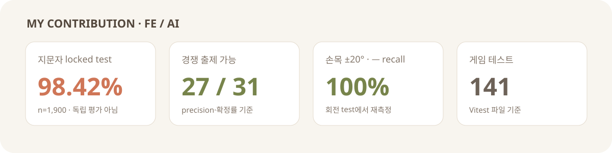
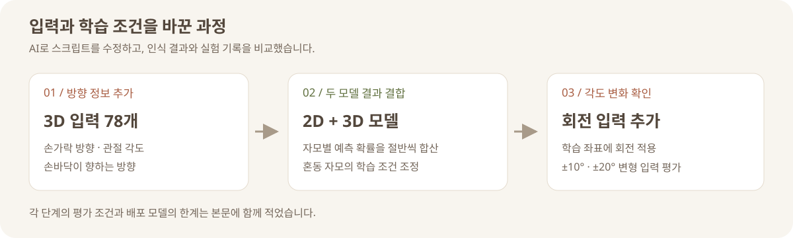
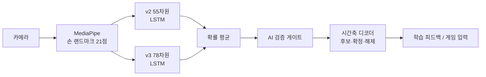
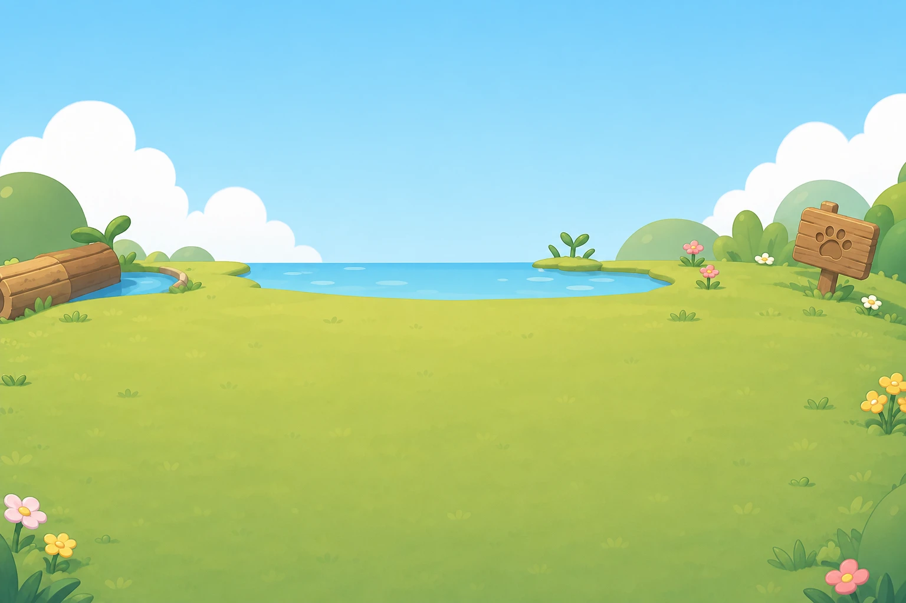
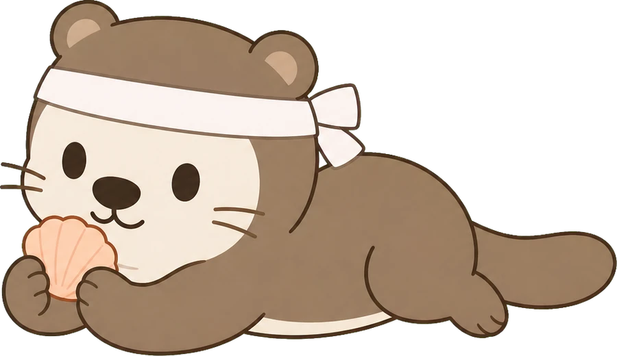

# 수어의 달인

  

  지문자 31개 분류 모델을 개선하고, 모델의 예측을 학습과 게임 입력으로 연결한 웹 서비스

  <a href="https://sudal-play.vercel.app">서비스</a> ·
  <a href="docs/portfolio-ai-fingerspelling.md">AI 개선 기록</a> ·
  <a href="docs/portfolio-game-frontend.md">게임 프론트엔드 기록</a>

> SSAFY 15기 공통 프로젝트 · 2026.07.16–2026.08.21 · 6인 팀
> 강형순 담당: **지문자 인식 모델·AI 서버, 게임 선택 이후 프론트엔드**

## 맡은 일

| 영역 | 담당 범위 | 사용 기술 |
| --- | --- | --- |
| 지문자 AI | 31자모 피처 설계, LSTM 학습, 듀얼 헤드 앙상블, 회전 증강, TFLite 변환, WebSocket 추론 서버 | Python, TensorFlow, TFLite, MediaPipe |
| 인식 제품화 | 모델 확률을 게임 입력으로 확정하는 시간축 디코더, 심볼별 출제 게이트, 최신 프레임 우선 처리 | TypeScript, WebSocket, 상태 머신 |
| 게임 프론트엔드 | 게임 선택 이후 전 화면, 한글 물리 블록, 1:1 P2P 대전, 턴 배틀 | React, Matter.js, PixiJS, WebRTC |

게임 코드는 `frontend/src/game` 아래에 모았다. 현재 기준 **TypeScript/TSX 517개, 33,571줄, 테스트 141개 파일**이다.

## 지문자 모델: 정확도보다 먼저 입력을 바꿨다

초기 2D 랜드마크 모델은 손가락의 깊이와 손바닥 방향을 잃었다. `ㅅ/ㅠ`, `ㅔ/ㅕ`처럼 화면에 투영된 모양이 비슷한 자모는 분류기나 손실 함수를 바꿔도 구분되지 않았다. 문제를 모델 크기가 아니라 입력 표현으로 보고 피처를 다시 설계했다.

> 위 수치는 실험 단계의 판단 근거다. 2D 정적 이미지 기준선과 이후 시퀀스 모델은 평가 데이터가 달라 정확도 차이를 직접적인 향상분으로 계산하지 않았다. 운영 모델 수치는 동일 촬영 영상의 앞 70%/뒤 30% 분할이며 신규 사용자 독립 평가가 아니다.

### 1. 2D로 사라지는 정보를 3D 피처에 담았다

**문제**

2D bone vector 40개와 관절 각도 15개만으로는 손의 앞뒤와 깊이 차이를 설명할 수 없었다. MLP, Residual MLP, SVM을 바꿔도 혼동쌍이 남았다.

**해결**

같은 MediaPipe 랜드마크에서 3D bone direction 60개, 관절 각도 15개, palm normal 3개를 계산해 78차원 `feature_v3`를 만들었다. 프론트가 이미 `x·y·z`를 전송하고 있어 API 계약은 바꾸지 않았다.

**결과**

v3 LSTM은 locked test 955개에서 93.3%를 기록했다. v2 전이 모델과 비교했을 때 `ㅅ` recall은 0.42→1.00, `ㅠ`는 0.59→1.00, `ㅔ`는 0.53→0.97로 바뀌었다.

### 2. 데이터가 많은 2D와 표현력이 있는 3D를 결합했다

**문제**

v3는 방향을 구분했지만 학습 시퀀스가 2,404개였다. v2는 33,738개 시퀀스를 갖고 있어 자모별 강점이 달랐다. v3 데이터의 stride만 줄여 3,359→6,693개로 늘린 실험은 정확도가 93.3→93.0%로 바뀌어 새 정보가 되지 못했다.

**해결**

한 프레임에서 v2 55차원과 v3 78차원을 함께 만들고, 두 LSTM 헤드의 확률을 0.5씩 평균했다. 혼동행렬에서 `ㅣ-ㅡ`, `ㅗ-ㅑ`, `ㅗ-ㅖ`, `ㅗ-ㅣ`, `ㅜ-ㅏ`를 산출해 hard-negative margin을 적용했다.

**결과**

듀얼 헤드만 적용했을 때 98.1%, hard-negative 2차 적용 후 98.68%를 기록했다. `ㅜ→ㅏ` 혼동은 recall 0.708→1.00으로 바뀌었다. margin을 강하게 준 1차 실험에서는 다른 자모가 밀리는 현상이 생겨 0.35에서 0.25로 낮췄다.

### 3. 테스트가 통과해도 실사용에서 실패할 수 있었다

**문제**

배포 후 `ㅡ`가 잘 인식되지 않았다. 기존 test에서 `ㅡ` recall은 1.00이어서 임계값 문제로 보였지만, 실제 원인은 촬영 영상에 없던 손목 각도였다.

**해결**

학습 샘플 60%에 회전 증강을 적용했다. v2는 화면 평면에서 ±22°, v3는 z축 ±22°와 y축 ±15°로 회전했다. test 입력도 ±10°와 ±20°로 회전해 따로 검증했다.

**결과**

±20°에서 `ㅡ` recall 1.00을 유지했다. locked test 정확도는 98.68→98.42%로 0.26%p 낮아졌지만 실사용 실패를 해결한 모델을 채택했다. `ㅓ`까지 margin으로 보정한 후속 실험은 전체 96.68%, `ㅡ` recall 0.707로 후퇴해 폐기했다.

## 모델 예측을 게임 입력으로 바꾼 경계

AI 서버는 후보와 확률만 반환한다. 최종 입력 확정은 브라우저의 시간축 디코더가 담당한다. 네트워크 지연과 모델의 순간 오인식을 게임 규칙에서 분리하기 위해서다.

- `NO_HAND → TRACKING → MOVING → CANDIDATE → CONFIRMED → RELEASE_WAIT` 6상태로 입력을 관리했다.
- 4프레임 중 2표와 100ms 안정 시간을 함께 만족해야 확정한다.
- 추론 요청은 `처리 중 1개 + 대기 중 최신 1개`만 둔다. 오래된 프레임은 버려 지연 누적을 막았다.
- 1,900개 평가에서 precision 90%, 확정률 85% 기준을 통과한 **27/31개 자모만 경쟁 모드에 출제**했다.
- 서버에는 손 랜드마크만 보내며 얼굴·영상·이미지는 보내지 않는다.

## AI를 게임에 적용했다

<table>
  <tr>
    <td width="58%"></td>
    <td width="42%"></td>
  </tr>
</table>

| 모드 | 구현 |
| --- | --- |
| 솔로 프링글수 | 인식한 자모를 Matter.js 물리 블록으로 만들어 쌓는다. 캔버스 알파 채널을 8px 셀로 읽어 한글 획 모양의 collider를 생성했다. |
| 1:1 프링글수 | WebRTC DataChannel과 브라우저 host authority로 진행한다. guest는 입력을 요청하고 host가 검증한 이벤트만 양쪽 보드에 반영한다. |
| 지문자 턴 배틀 | 자모를 기술 카드로 사용하는 턴제 대전. 결정적 PRNG와 상태 머신으로 로컬 봇·P2P가 같은 규칙을 쓴다. |

백엔드는 방 생성·참가·결과 저장과 WebRTC signaling만 맡는다. 게임 상태를 서버에서 중계하지 않아 발생한 중복 생성과 재접속 문제는 host authority, 5초 snapshot, FNV-1a checksum, tombstone으로 처리했다. 구현 과정은 [게임 프론트엔드 기록](docs/portfolio-game-frontend.md)에 정리했다.

## 기술 선택

| 선택 | 이유 |
| --- | --- |
| 랜드마크 전송 | 영상 전송 없이 추론하고, 프론트와 AI의 입력 계약을 21개 점으로 고정 |
| v2 + v3 듀얼 헤드 | 데이터가 많은 2D 헤드와 방향을 보존한 3D 헤드의 자모별 강점을 결합 |
| TFLite unroll 변환 | Flex 연산 의존을 제거하고 AI 서버의 TensorFlow 버전 제약을 줄임 |
| 프론트 확정 권위 | 모델 확률, 네트워크 응답, 게임 입력 잠금을 각 계층에서 분리 |
| WebRTC DataChannel | 1:1 게임 상태를 백엔드에 추가하지 않고 브라우저끼리 교환 |
| Matter.js + PixiJS | 충돌 계산과 WebGL 효과를 나누고 React 렌더 주기와 게임 루프를 분리 |

## 검증

| 대상 | 확인 항목 |
| --- | --- |
| 지문자 모델 | locked test 1,900개, 클래스별 precision·recall·확정률, ±20° 회전 test |
| AI 서버 | 모델 계약·feature parity·WebSocket session·handshape gate 회귀 테스트 |
| 게임 프론트엔드 | 141개 테스트 파일. 타이머·랜덤·소켓·미디어·fetch를 주입해 실제 대기 없이 검증 |
| 출제 계약 | `ai/contracts/recognition/readiness.json` 하나에서 심볼별 임계값과 경쟁 출제 가능 여부 파생 |

## 한계

- 98.42%는 자모별 촬영 영상의 앞 70%를 학습하고 뒤 30%를 평가한 결과다. 신규 사용자 독립 성능으로 해석할 수 없다.
- 최종 모델에서 `ㅓ` recall은 0.7049다. 임계값을 낮추면 `ㅡ` precision이 무너져 경쟁 모드에서는 둘을 포함한 4개 자모를 제외했다.
- 카메라·MediaPipe·AI 응답의 실제 p95 지연을 수집하는 코드는 있으나 결과를 저장하지 않아 기기별 수치는 미측정이다.
- 다중 사용자 손 소유권 판정은 구현했지만 실기 군중 테스트가 없어 기본 게임 경로에서는 껐다.

## 코드 시작점

| 보고 싶은 내용 | 위치 |
| --- | --- |
| v2/v3 피처와 앙상블 | [`ai/game-server/app`](ai/game-server/app) |
| 모델 학습·평가 기록 | [`model-evaluation.md`](ai/game-server/docs/recognition/model-evaluation.md) |
| 운영 모델 계약 | [`manifest.json`](ai/models/jamo-31-ensemble-v1/manifest.json) |
| 경쟁 출제 기준 | [`readiness.json`](ai/contracts/recognition/readiness.json) |
| 시간축 디코더 | [`frontend/src/game/recognition/temporal`](frontend/src/game/recognition/temporal) |
| 게임 모듈 | [`frontend/src/game`](frontend/src/game) |

## 팀 프로젝트 표기

이 저장소는 6명이 함께 만든 프로젝트의 포트폴리오용 복제본이다. 서비스 전체 결과와 개인 담당을 구분하기 위해 이 README에는 강형순의 작업을 중심으로 작성했고, 기존 Git 이력과 작성자 정보는 유지한다. 공개 이용 허가를 의미하는 라이선스는 별도 합의 전까지 추가하지 않는다.
