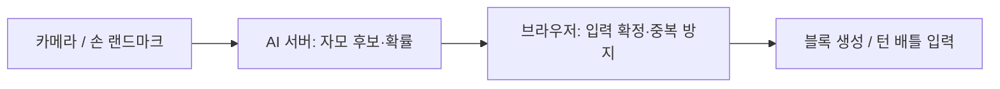

# 수어의 달인

지문자 인식 모델의 학습·튜닝과 게임 선택 이후 프론트엔드를 맡았습니다. 웹캠으로 만든 손 모양을 인식해 한글 블록을 쌓거나 상대와 대전하는 6인 팀 프로젝트입니다.

학습 스크립트 작성과 튜닝에는 AI의 도움을 받았습니다. 저는 인식이 섞이는 자모를 확인하고, 입력 데이터와 학습 조건을 바꾼 결과를 비교했습니다. 모델의 예측을 게임에서 언제 입력으로 받아들일지도 함께 조정했습니다.

  

[서비스](https://sudal-play.vercel.app) · [모델 학습·튜닝 기록](docs/portfolio-ai-fingerspelling.md) · [게임 프론트엔드 기록](docs/portfolio-game-frontend.md)

## 맡은 일

| 구분 | 내용 |
| --- | --- |
| 기간·팀 | 2026.07.16–2026.08.21 · SSAFY 6인 팀 |
| 지문자 모델 | 31개 자모의 학습·튜닝, TFLite 변환과 추론 서버 연결 |
| 인식 결과 처리 | 예측을 게임 입력으로 확정하는 조건, 중복 입력과 응답 지연 처리 |
| 게임 프론트엔드 | 게임 선택 이후 화면, 한글 블록 쌓기, 1:1 대전과 턴 배틀 |

아래 내용은 제 담당 작업을 기준으로 정리했습니다. 수어 문장을 번역하는 모델이 아니라 손으로 표현한 자모를 분류하는 모델입니다.

## 손의 방향 때문에 섞이는 자모를 줄였습니다

2D 좌표만 사용했을 때 손의 앞뒤와 손바닥 방향이 입력에 남지 않아 일부 자모가 섞였습니다. MediaPipe가 제공하는 x·y·z 좌표에서 손가락 방향, 관절 각도, 손바닥 방향을 계산하도록 스크립트를 수정했습니다. 이렇게 만든 78개 값으로 3D 모델을 학습하고, 기존 2D 모델과 예측 확률을 절반씩 합쳤습니다.

테스트에서는 인식되던 `ㅡ`가 직접 사용할 때는 잘 잡히지 않는 문제도 있었습니다. 손목 각도를 바꿔 확인한 뒤 학습 입력에 회전을 추가했습니다. 전체 정확도는 98.68%에서 98.42%로 내려갔지만, 회전시킨 평가 입력에서도 `ㅡ`의 인식을 확인하고 이 모델을 선택했습니다.

**98.42%는 동일 촬영 영상의 앞 70%를 학습에, 뒤 30%를 평가에 사용한 결과입니다.** 평가 시퀀스는 1,900개이며, 촬영에 참여하지 않은 사람을 대상으로 측정한 정확도는 아닙니다. 경쟁 모드는 내부 출제 기준을 통과한 27개 자모만 사용했습니다.

[입력과 학습 조건을 바꾼 과정 →](docs/portfolio-ai-fingerspelling.md)

## 한 번 만든 손 모양이 여러 번 입력되지 않게 했습니다

한 프레임의 예측을 바로 입력으로 쓰면 순간 오인식이 게임에 반영되고, 같은 손 모양을 유지하는 동안 블록이 반복해서 생겼습니다. 후보가 일정 조건을 만족할 때만 확정하고, 확정 후에는 손 모양을 풀거나 다음 입력 조건을 만족해야 다시 입력되도록 했습니다.

안정성을 확인하는 기본 설정은 4프레임 중 2표와 100ms 유지 조건입니다. 실제 솔로·대전 화면은 반응을 빠르게 하기 위해 2프레임 중 1표와 35ms 유지 설정을 사용합니다. 이는 입력 확정 설정값이며, 카메라부터 게임 반영까지 측정한 응답 시간은 아닙니다.

추론 응답을 기다리는 동안에는 다음 요청으로 보낼 프레임을 최신 1개로 덮어썼습니다. 응답도 요청 순서와 세션을 확인해 이미 지난 결과가 입력으로 반영되지 않도록 처리했습니다.

AI 서버로는 손 랜드마크를 보냅니다. 대전 상대에게 보여주는 영상은 별도의 WebRTC 연결을 사용합니다.

## 대전에서 양쪽 보드가 다르게 바뀌는 문제를 정리했습니다

공통 목표 자모를 두 사람이 거의 동시에 맞히면 양쪽에서 각자 블록을 생성할 수 있었습니다. WebRTC DataChannel로 입력을 교환하되 호스트가 먼저 도착한 유효 입력을 승인하고, 승인 결과에 따라 보드에 반영하도록 했습니다. 호스트가 판정을 맡는 구조이며, 서버에서 치팅까지 검증하는 방식은 아닙니다.

재접속 시 상대방 보드까지 초기화되는 문제는 복구 대상을 재접속한 플레이어로 한정했습니다. 게임 상태의 수명도 영상 연결 상태와 분리해 영상 연결이 바뀔 때 보드까지 정리되지 않도록 수정했습니다.

<table>
  <tr>
    <td width="58%"></td>
    <td width="42%"></td>
  </tr>
</table>

[중복 입력·대전·재접속 수정 기록 →](docs/portfolio-game-frontend.md)

## 코드와 확인 범위

| 내용 | 위치 |
| --- | --- |
| 모델 입력·추론 | [AI 서버](ai/game-server/app) |
| 학습·평가 기록 | [모델 평가 기록](ai/game-server/docs/recognition/model-evaluation.md) |
| 배포 모델의 평가값 | [모델 manifest](ai/models/jamo-31-ensemble-v1/manifest.json) |
| 자모별 출제 기준 | [readiness](ai/contracts/recognition/readiness.json) |
| 입력 확정 조건 | [시간축 디코더](frontend/src/game/recognition/temporal) |
| 게임 구현·테스트 | [게임 모듈](frontend/src/game) |

모델 평가는 촬영 데이터 내부 검증까지 진행했습니다. 다른 사람·조명·카메라에서의 인식률과 기기별 전체 응답 시간은 별도로 측정해야 합니다.
